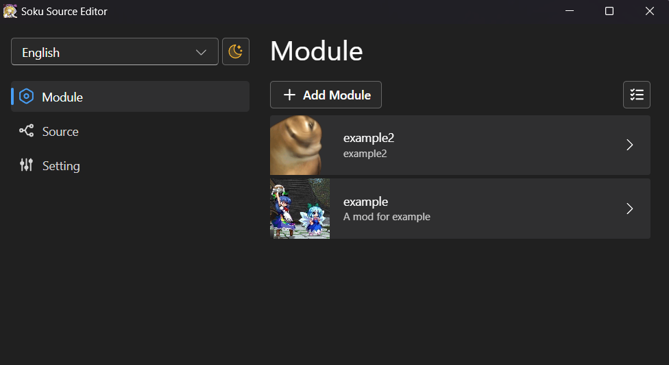

# SokuSourceEditor
Used for editing the mod source for the [SokuLauncher](https://github.com/0Miles/soku-launcher) mod store, managing and publishing mods on the source.  



## Install Git  
This tool requires [git](https://git-scm.com/), please install it and complete the basic setup.
1. Refer to [https://git-scm.com/downloads](https://git-scm.com/downloads) for the completion of the git installation.
2. To set up your name and email in git
```shell
$ git config --global user.name "Your Name"
$ git config --global user.email "your.email@example.com"
```

## Dev
Clone and install dependencies:

```bash
git clone https://github.com/0Miles/soku-mod-manager.git
cd soku-mod-manager
npm install
```

## Starting dev
Open two terminals and execute the following
```bash
npm run dev:vite
```

```bash
npm run dev:electron
```