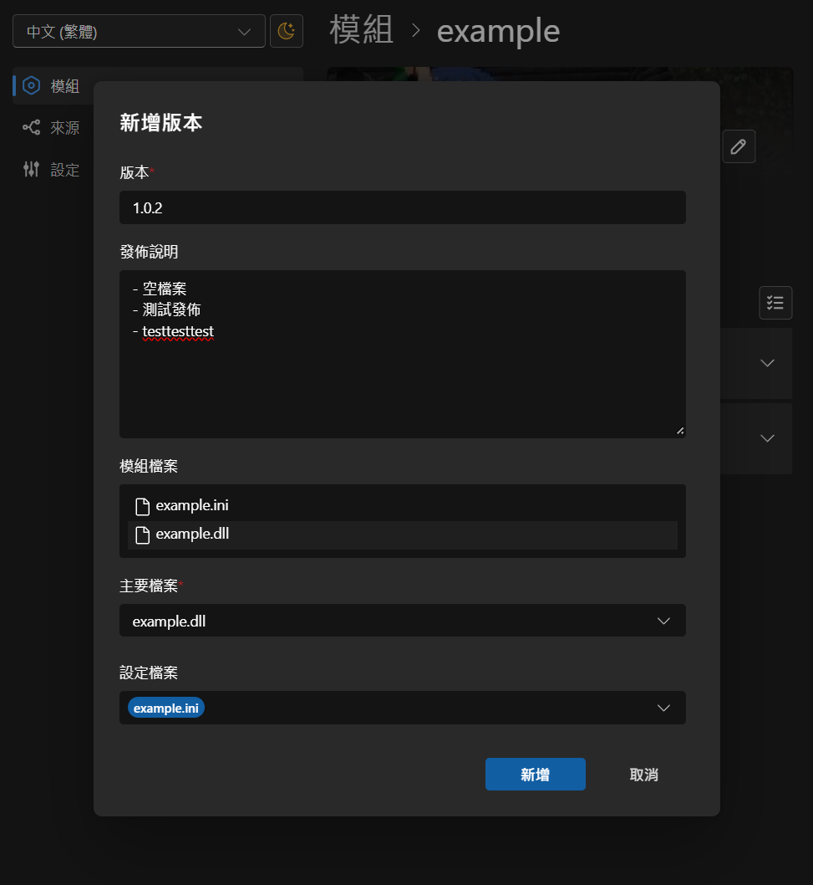
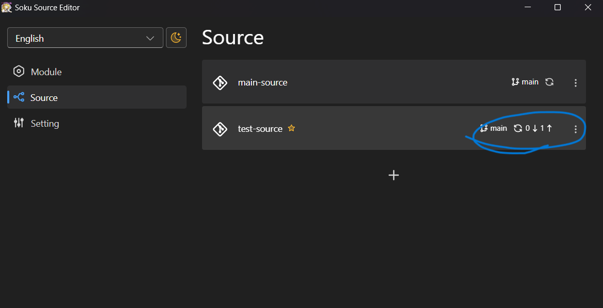

# Release on Gitee
English | [中文](../zh-Hans/release-on-gitee.md)  
  
- [Introduction](./introduction.md)
- [Getting Started](./getting-started.md)
- [Edit Module](./edit-module.md)
- [Release Version](./release-version.md)
- Release on Gitee

## Prerequisites
### Generate Gitee Token
Top left corner - Profile > Settings > Left sidebar - Security Settings - Personal Tokens > Top right - Generate New Token  

### Set Gitee Token
Settings > Gitee Token  
Enter the token generated in the previous step.

### Set Repository
Ensure the module has the Gitee repository set.
  
Paste the complete repository URL and click the + on the right to add.

## Publish

### Create Version

### Publish to Gitee

### Manually Upload Module Zip Package

Gitee does not provide an API for uploading attachments; it must be done manually.
It will automatically open the browser to the output directory. Drag the zip file into Gitee's upload box and click "Update."

### Release Completed
The release is now complete. 
You can continue with the release on Github or perform other actions.

After completion, remember to click "Sync" on the Source page to push the changes to the source repository.
