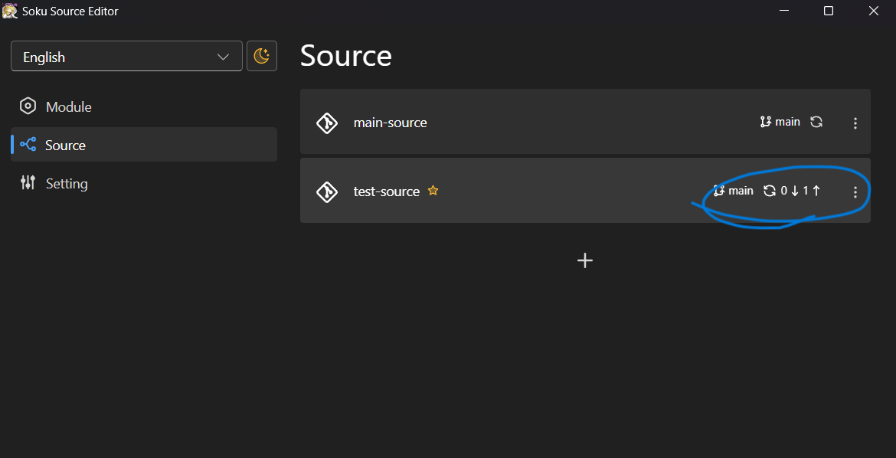

# Release Version
English | [中文](../zh-Hans/release-version.md)  
  
- [Introduction](./introduction.md)
- [Getting Started](./getting-started.md)
- [Edit Module](./edit-module.md)
- Release Version
- [Release on Gitee](./release-on-gitee.md)

## Preliminary Steps
### Create Github Personal Access Token
Please refer to [this official Github document](https://docs.github.com/en/authentication/keeping-your-account-and-data-secure/managing-your-personal-access-tokens) to create a personal access token. Make sure to select at least the following permissions:
- ``repo``
- ``admin:org > write:org``
- ``admin:org > read:org``

### Set Github Token
In the Settings page, enter the token generated in the previous step into the Github Token field.
.png)

## Create Version
On the module page where you want to create a version, click the "Add Version" button.
.png)

Drag the new version module file into "Module files," enter the relevant information, and then click "Add."
.png)

- The "Release notes" field supports multiple languages and markdown, serving as the content displayed on Github Release. Only the content under the "Default" language will be published on Github; other language contents will be displayed in SokuLauncher's update prompts.

- "Main file" refers to the file serving as the entry point for the module, typically a DLL file.
- "Config files" are files used as configuration files. During an update, if users' module folders already contain these files, their existing files will be retained without being overwritten.

## Publish to Github
Click the "Release" button.
.png)

Select the target repositories you want to publish to and click "Release."
.png)
If you check "Set this version as the recommended version after releasing," this version will automatically be set as the recommended version after publishing, available for users to update.

Wait a moment for the release to complete.
.png)

## Sync Changes to Remote Repository
After creating a version or publishing, you need to sync the changes to the remote module repository.
Click the sync button next to the Source with changes in the Source tab. The synchronization process typically completes within a few seconds.
