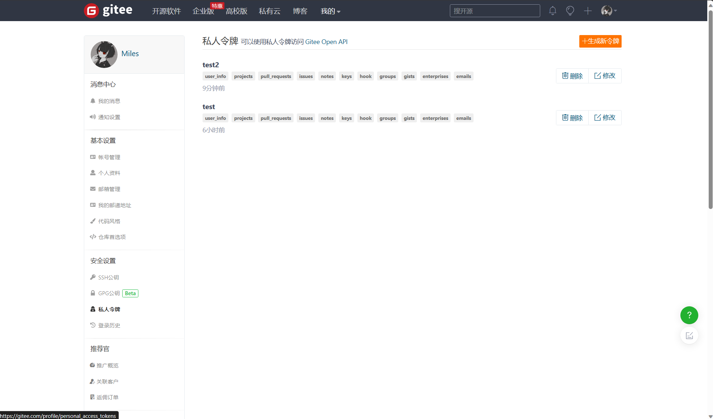
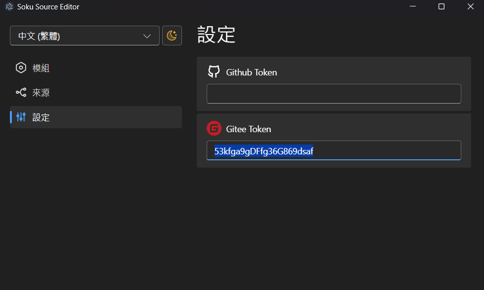
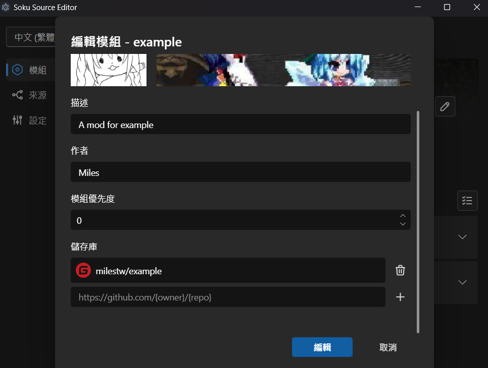
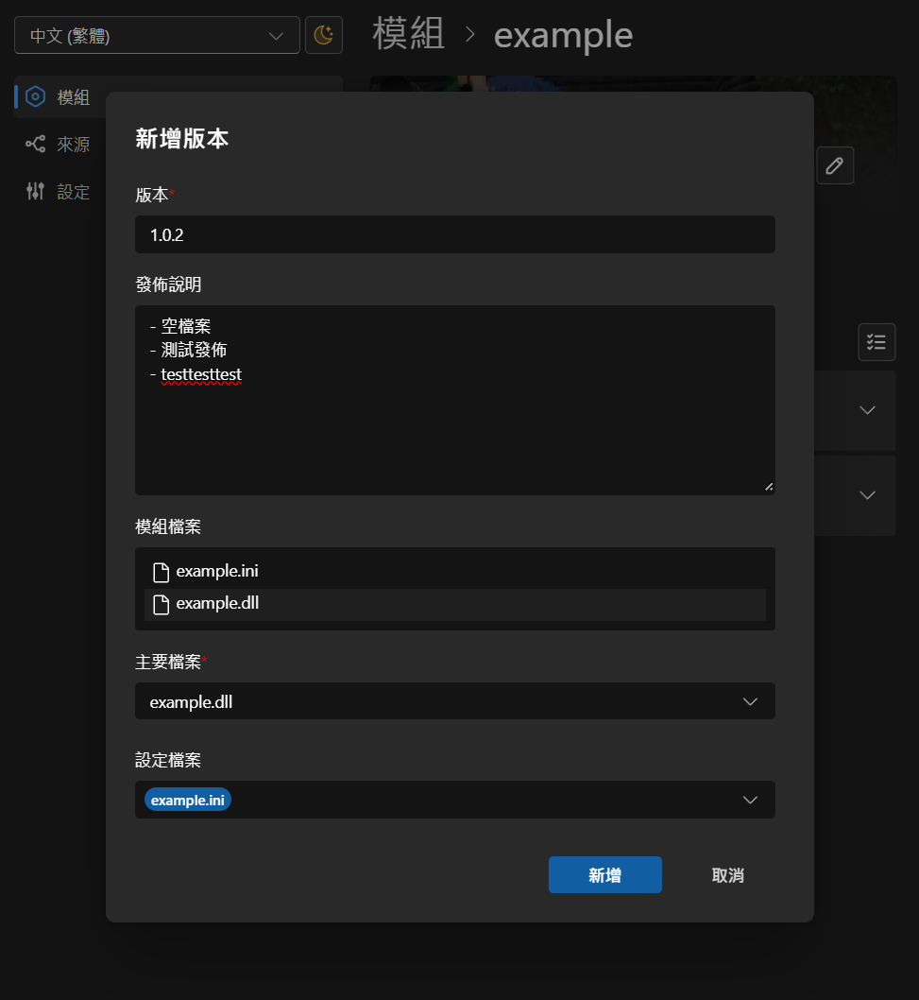
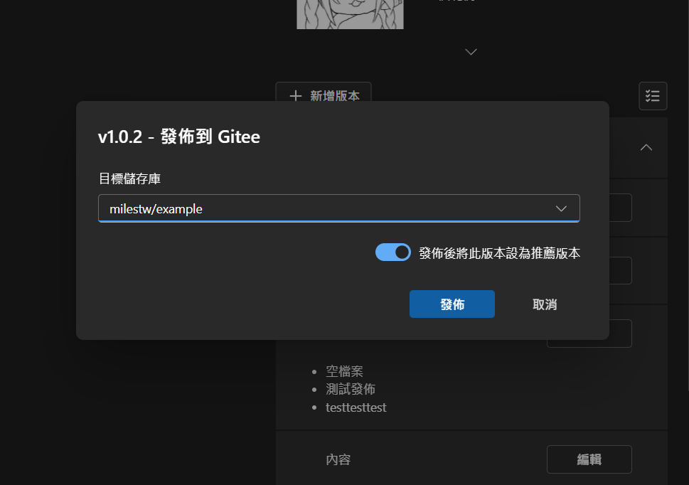
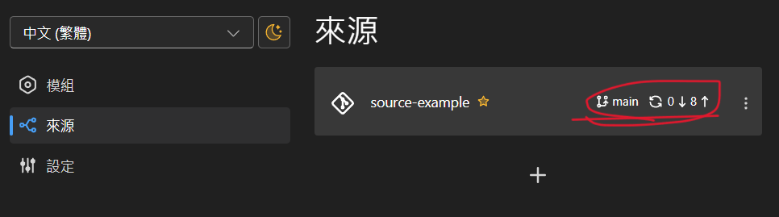

# 发布到Gitee

## 前置
### 生成 Gitee token
左上角人头 > 设置 > 左方侧边栏-安全设置-私人令牌 > 右上角 生成新令牌  

### 设置 Gitee token 
设定 > Gitee Token  
输入前一步生成的令牌

### 设置储存库
确认模组设置了Gitee的储存库  
  
贴上完整储存库URL，按右边的 + 来添加

## 发布

### 建立版本

### 发布到Gitee

### 手动上传模组zip包

 Gitee没有提供上传附件的API，只能手动上传  
会自动打开浏览器和output目录，把zip拖到Gitee的上传框就行了  

### 发布完成
到这边发布就完成了  
可以继续在Github发布或其他操作

完成后记得在来源页按一下同步，将更动推到来源储存库上  
