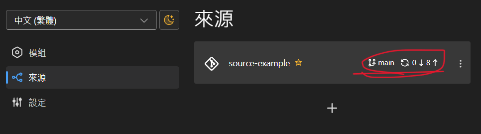

# 编辑模块
[English](../en/edit-module.md) | 中文  
  
- [介绍](./introduction.md)
- [开始使用](./getting-started.md)
- 编辑模块
- [发布版本](./release-version.md)
- [发布到Gitee](./release-on-gitee.md)

## 添加模块
点击"添加模块"按钮。
.png)
  
填写模块信息，然后点击"添加"以创建模块。
.png)

"描述"字段支持Markdown和多种语言。您可以通过右上角的下拉菜单切换要编辑的语言。  
  
"模块优先级"影响游戏执行期间模块加载的顺序，对于旧版本的d3d9.dll用户影响更为显著。通常，将其保持为0就足够了。  
  
"存储库"字段可以填写用于存储发布的Github仓库。  
- 如果您是模块作者，可以使用自己的模块存储库。  
- 如果您是源代码维护者，建议使用[package-template](https://github.com/soku-cn/package-template)创建一个包含README.md的组织存储库，并指示原始模块存储库的位置以存储发布。

## 修改模块信息
转到要修改的模块页面，然后点击模块卡上的铅笔图标。
.png)  

进行必要的更改后，点击"编辑"。

## 将更改同步到远程存储库
创建或编辑模块后，您需要将更改同步到远程模块存储库。

点击Source标签中带有更改的Source旁边的同步按钮。同步过程通常在几秒钟内完成。
